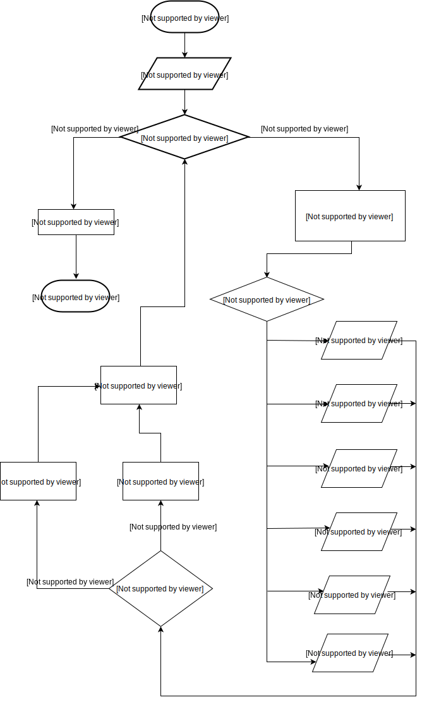

# 1º Projeto de Introdução à Computação 2017/2018
 #

#### Madalena Marcelino (a21700854)
#### Rui Martins (a21701462)

## Descrição da solução ##
Para a realização deste trabalho criámos três variáveis iniciais, uma para receber
o número de perguntas a apresentar ao utilizador, outra para receber a resposta às
conversões e uma para registar o número de respostas certas.
Gerámos uma semente
aleatória com `srand((unsigned int) time(NULL))`. De seguida, criámos um uma
instrução for com a variável `i` a servir de contador, em que o seu valor inical é
1 e onde ciclo é executado enquanto essa mesma var for menor ou igual que
`nperguntas`.
Dentro do ciclo `for` criámos duas variáveis. A uma atribuímos um
número aleatório positivo de 1 a 255 com `(rand()%255)+1` que é utilizado como o
número mostrado ao utilizador para este converter. A outra variável recebe um
número de 1 a 6 através do mesmo procedimento mas esta serve para ser usada no
`switch` para que possamos ter um 6 casos aleatórios. 
Em cada um dos casos
é mostrado o número aleatório guardado em `perguntas` como decimal, hexadecimal
ou octal e é pedido ao utilizador que converta o mesmo para uma das outras duas
bases. 
Ex: No `case 1:` é mostrado o número em octal e o programa pede ao
utilizador para converter para base 10 enquanto que no `case 2` o programa mostra
o número na mesma base mas pede a conversão para base 16.

Após a resposta por parte do user, caso a conversão esteja correcta a variável
`rcertas` é incrementada em 1 e é mostrada a mensagem "Certo!" no ecrã. Se a
conversão estiver errada aparece simplesmente a mensagem "Errado!".

No final de todos os ciclos `for` aparece uma mensagem com o número de vezes
que o user acertou através da variável `rcertas`.

## Fluxograma

## Material utilizado para a realização do trabalho ##
- Notepad++
- https://www.draw.io/

## Conclusões da Matéria ##
1. Melhor compreensão de `scanf` e `printf` em bases diferentes;
2. Funcionamento do `rand()` e `srand()`
3. Ciclos `switch`, `for` e `if`

## Referências ##
##### Bibliotecas utilizadas
> stdio.h, time.h, stdlib.h

##### Colegas de apoio
> Diogo Maia, Francisco Freixo

##### Links de apoio
> https://stackoverflow.com/

