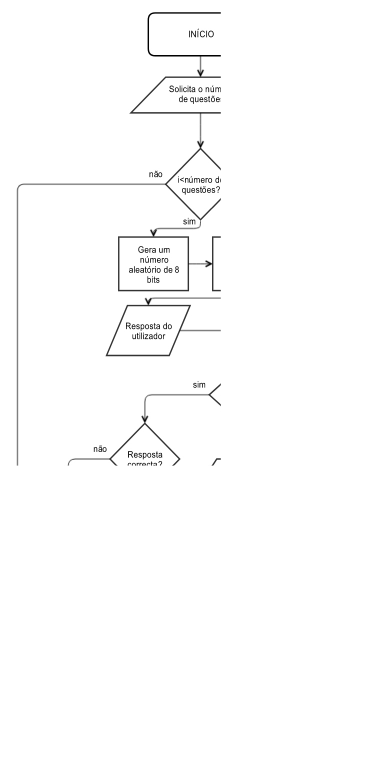

## Universidade Lusófona
##### Licenciatura em Aplicações Multimédia e Videojogos | Introdução à Computação

### Jogo de conversão de bases

	Cristina Pietra nº a21701350
	Pedro Siqueira nº a21705187
	10 de Novembro de 2017

#### 1. Introdução

Como primeiro projecto da cadeira de Introdução à Computação foi proposta a implementação de um jogo, em linguagem C, que teste o conhecimento de bases numéricas. 
Em grupos de dois, o material a entregar deve conter o ficheiro com código, o fluxograma do projecto e o relatório em formato *Markdown*.
O programa deve, através de *input* dado pelo utilizador, imprimir questões e validar as respostas do jogador.

De forma a tonar isto possível, o jogo deve corresponder aos seguintes parametros: 


###### Inicialização

* Solicitar ao utilizador o número de questões a que deseja responder.
* Imprimir, uma a uma, as questões solicitadas e esperar *input*.


###### Questões

* As perguntas devem ser geradas aleatóriamente, assim como os valores para converter.
* Bases aceites para conversão: 
  * Octal para decimal;
  * Octal para hexadecimal;
  * Decimal para octal;
  * Decimal para hexadecimal;
  * Hexadecimal para octal;
  * Hexadecimal para decimal;

###### Valores
* Os valores a converter devem ser aleatórios, positivos e com um máximo de 8 bits.


###### Pontuação

* O programa deve imprimir se cada resposta está correcta ou não.
* Após a validação das respostas do utilizador, segue-se a contagem de respostas correctas.
* Ao imprimir a *score* do jogador, o programa termina.




#### 2. Descrição da solução

O programa tem como primeiro objectivo perguntar ao utilizador a quantas questões pretende responder. Para isso, foi utilizada a função *printf* para formular a pergunta e *fgets* para ler o input do utilizador. Uma vez que o input foi recebido em formato *string*, optou-se por usar a função *sscanf* para o converter o *integer*. Este inteiro foi guardado na variável **_numberQuestions_**.

```c
printf("\nInsira o número de questões a que deseja responder: ");

fgets(string, 100, stdin);
sscanf(string, "%d", &numberQuestions);
printf("Número de questões: %d\n\n", numberQuestions);
```

Ao ter o número de questões solicitadas, guardado na sua respectiva variável, foi utilizado um ciclo *for* para que fosse impressa uma questão em cada iteração e terminando quando a condição (i < **_numberQuestions_**, sendo i um contador auxiliar) se tornasse falsa.

```c
for (int i = 0; i < numberQuestions; ++i){
	//código...
}
```

Com propósito auxiliar, foram criadas duas variáveis (**_number_** e **_question_**) que guardassem valores aleatórios. Para esse efeito, foi utilizada a função *srand()* da biblioteca *time.h*. Foi definido que a variável **_number_** seria um número aleatório entre 0 e 255 (correspondente a um valor para conversão). Por sua vez, a variável **_question_** determinaria um número aleatório entre 0 e 5, esta com o objectivo de seleccionar uma das 6 questões predefinidas.

```c
number = (rand()%0xFF);
question = (rand()%6);
```


Tendo as variáveis já definidas, criou-se um *switch statement* da variável **_question_**. Cada *case* contém uma questão e o seu respectivo valor (aleatório) de base já definida. Inicializa-se o *case* com um *do while loop*, este com o objectivo de repetir a pergunta caso o input do utilizador seja considerado inválido. Respectivamente, dentro do *do while*, o programa imprime uma pergunta e espera pela resposta do jogador. Esta, tal como a variável **_numberQuestions_**, é lida como string e convertida para um inteiro, sendo guardada na variável **_input_**. A validação da resposta do utilizador procede-se através de um *if statement* que apenas aceita valores entre 0 e 255. Caso o programa considerar a resposta inválida, é pedido ao jogador que introduza um novo valor. A variável **_aux_** passa a corresponder ao valor 0, fazendo com que não corresponda à condição do *do while*. O ciclo repete-se, assim como a questão inicial, e o programa só sai do *do while* caso o valor introduzido seja válido.

```c
switch(question){

  case 0:

    do{ //Loop para validar a resposta
      printf("Converte o número octal %o para base 10: ", number); 

      fgets(string, 100, stdin);
      aux = sscanf(string, "%d", &input);

      if (input >= 0x0 && input <= 0xFF){
        break;
      }
      else{
        printf("\nNúmero inválido, tente novamente.\n\n");
        aux = 0;
      }
    }while(aux != 1);
  
  //...
```

Uma vez que o input seja válido, o valor é guardado na variável **_answer_**.

```c
sscanf(string, "%d", &answer);
break;
```


Ao sair do *switch statement*, a variável **_answer_** é comparada com a variável **_number_** (ou seja, compara-se a resposta do utilizador com a resposta correcta), como condição de um *if statement*. Se as variáveis tiverem valores iguais, o programa confirma ao utilizador que a sua resposta está correcta. No caso de a condição não se verificar verdadeira, é impresso que a resposta do jogador está errada. 

Também dentro do *if statement* é contabilizada o número de respostas correctas, sendo estas guardadas na variável **_score_**.

```c
if (number == answer){
  printf("\nCerto!\n\n");
  score++;
}
else{
  printf("\nErrado!\n\n");
}
```


Após o utilizador responder a todas as questões solicitadas, o programa imprime a pontuação do jogador (valor guardado na variável **_score_**), ou seja, o número de respostas correctas. 

Dá-se assim como finalizado o programa, encerrando de imediato.

```c
printf("Número de respostas correctas: %d\n", score);
```


#### 4. Conclusão

Ao realizar este projecto tivemos a oportunidade de explorar o nosso conhecimento da linguagem C e na conversão de bases. Tentámos corresponder ao que era pedido nas especificações e pensamos que fomos capazes de cumprir todos os requisitos. Quisemos, porém, evitar algumas das situações que pudessem prejudicar o funcionamento correcto do programa. Por esse motivo, fizemos com que as respostas do utilizador passassem por um processo de validação antes de serem dadas como correctas ou erradas. Isto para que, dentro do possível, o programa continuasse a funcionar correctamente. Embora ainda existam inputs que o programa não sabe avaliar correctamente, conseguimos limitar as suas hipóteses de falha. 

Assim, a realização deste projecto deixou-nos familiarizados com linguagem C e a sua correcta utilização. Permitiu-nos cometer erros e aprender com eles, através de pesquisa, várias tentativas e conceitos dados em aula.

#### 4. Referências

Bibliotecas utilizadas: 
* stdio.h
* stdlib.h
* time.h
* string.h
