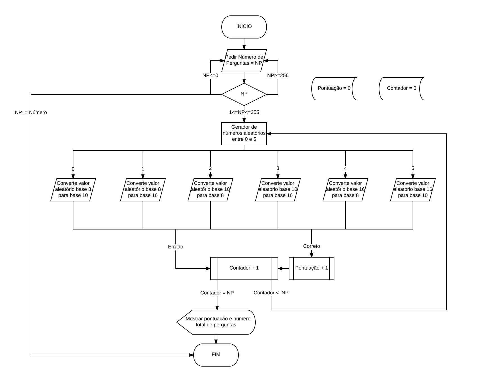

# Primeiro projeto de Introdução à computação

Trabalho realizado por Joana Marques (a21701929) e Pedro Santos (a21702907)  

## Descrição da solução 

Para resolver o problema, começámos por pedir ao utilizador o número de perguntas a que deseja responder e guardar esse número numa variável. Visto que não pode haver um número de perguntas menor ou igual a 0 ou maior do que 255, utilizámos um ciclo "while" para quando forem inseridos números dentro destes valores, esses sejam considerados números inválidos e o programa volta ao início. Se o utilizador colocar uma letra, o programa não corre mais. Somente após isto é que utilizámos o ciclo "for" para o programa correr as vezes que o utilizador pediu. 

Posteriormente inserimos uma variável que nos fornece um número aleatório entre 0 e 5 para escolher o tipo de pergunta que o utilizador irá responder e com o "switch" criámos 6 casos diferentes (visto que tínhamos 6 tipos de perguntas possíveis), cada um destes casos continha um tipo de pergunta, por exemplo converter um numero decimal para hexadecimal. Os números a converter foram gerados aleatoriamente com a função "rand()". Dentro de cada caso colocámos um "if...else" para comparar a resposta dada pelo utilizador com a resposta gerada pelo computador. Se estiver correta , é adicionado "1" à variável "certas"(que funciona como um contador de respostas certas),o utilizador é avisado de que acertou e passa para a pergunta seguinte. Se errar, é informado de que errou e passa á pergunta seguinte sem adicionar "1" á variável "certas".

No final do programa colocámos um "printf()" a informar o utilizador de quantas respostas acertou, no total de perguntas que tinha para responder.

[Fluxograma](https://drive.google.com/file/d/1dvZr2p65V9teyN3R8SskYyaiPIK5nNKo/view)

## Conclusões e matéria aprendida

Com este trabalho reforçámos o nosso conhecimento em linguagem C (ciclos while, for e if) e aprendemos a gerar número aleatórios dentro de determinado intervalo (rand()% n -> gera números aleatórios entre 0 e n). Também aumentou a nossa autonomia em relação à criação de novos programas em C e aumentou a nossa atenção em aspetos como a adição de comentários, identação e organização e sintaxe de código em C.
 

## Referências

* Elaboração do relatório em formato markdown 

    * [Markdown editor](https://jbt.github.io/markdown-editor/#bVNBbtswELzzFVs4gO3GltpremqTpgkQA0WTnoICoUVSpC1yBXJlJyn69y4pw84hgAnJ5HBmd2Y1gdkPRzfDenndyR1GreawknGrcB/gu3KEUYhvMrkGhqTN0IHRkoaooXOJLoSAj3BJsTu/hxouveInISS500BWg3GdPkGsM3QCHv4xvLGISR8vynQqASPcPKzuMsdVlC3IoEBF7EEWbnCBb1kdy+0OpQJHGXydDxsMpAMlkHyeqfk0lLp+/7qDhPCCAzQyQLIZkQmTEOJ26iEgtIgKJME+OnKhZQLfM2mdcZ2OQPqZFpmlxYJhCfSabMYycUy6M5UQd4jbBZeb/fpQ/DKI+bGWcXy8CvGV28pdTFMh4cqV/gAX55/Z4aenp43cydRE15M4m5khNOQwzOZ/BcDZbKrcbjqvLPluNr0F6VmMt6rp/Iv4x4vvC/FgXQL+PWKAMfA/M0vUp4u6bh3ZYV016OvNmmp/8H6pS/zz3GKnCbisbcA9OAO3U45p/Slus6NUSt7n8rld8ZPTSTmNVazgCnFdMsvyj7krGFlHdRb3UTGmiPcRN7qhVGfcQb2eL8BE9LC3rrEiZ+dC6l2U2YIsw4anRdEozll+ewGXo/Kc/QjjTIhBjfS5xMlkAvc0GJNHWmUOL7e6EI0D/Xi0wNG7Nr05f/s+52jjaXZ7GRMPQ2G85JZWLsY3necufdmqgqZ6vJwblHtdWkkvXP/z0rrWdryIax1NKYzH7WqTjpwJDe15lr0MTjapwtiWvfqIrnU4SI30cDzJc8ufBw7UD1QmENYdNttU5DZpqbTpJOl3HVEybLGVrj7hRpX21fV9pkYDSpI82s1zY3ixIn+MSfwH)

    * [Basic writing and formatting syntax](https://help.github.com/articles/basic-writing-and-formatting-syntax/)
         

* Elaboração do fluxograma 

   * [Flowchart Symbols Defined](http://www.breezetree.com/article-excel-flowchart-shapes.htm)

   * [Lucidchart](https://www.lucidchart.com)

* Elaboração do código do jogo

   * Pereira, A. (2017). C e Algoritmos, 2ª edição. Edições Sílabo.

   * Diálogo com os colegas sobre qual seria a melhor resolução para o problema.
