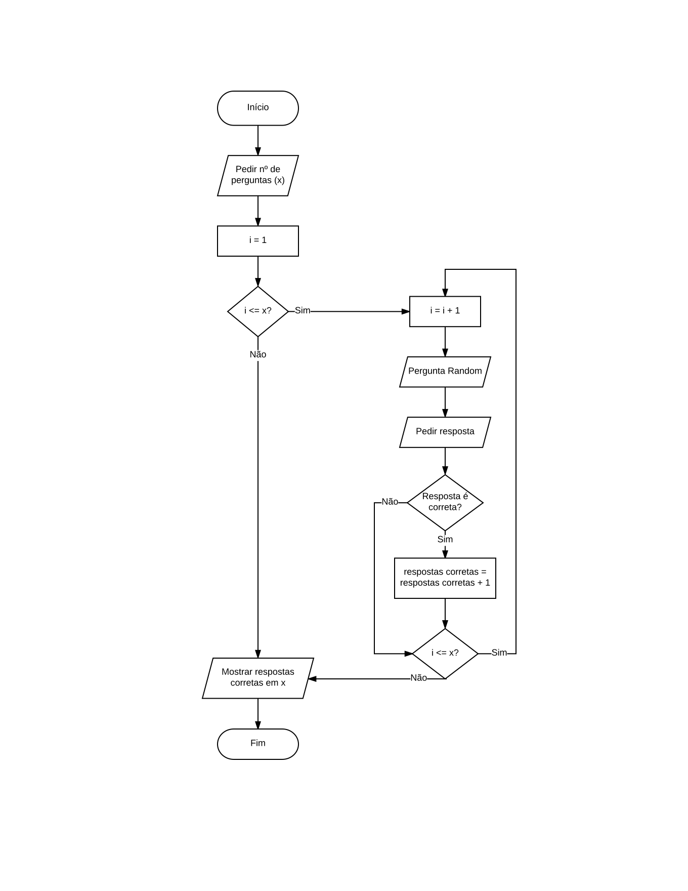

# 1º Projeto de Introdução à Computação 
Realizado por:

+ Diogo Maia Nº a21704165
+ Franciso Freixo Nº a21701661

## Descrição da solução
Foram utilizadas as seguintes bibliotecas:

```c
#include <stdio.h>
#include <stdlib.h>
#include <time.h>
```

Para a realização do trabalho começámos pela randomização de valores aleatórios de 8 bits:
```c
srand((unsigned) time(NULL));
```
```c
perguntas = (rand() % 255) + 1;
int r2 = (rand() % 6) + 1;
```

Um `for` em âmbito de `x` foi criado para obter o numero de perguntas solicitado:
```c
for (int i=1; i <= x; i++){
```

De seguida, aferimos o número de casos possíveis de perguntas para o utilizador:
1. Decimal -> Octal
2. Decimal -> Hexadecimal
3. Octal -> Decimal
4. Octal -> Hexadecimal
5. Hexadecimal -> Decimal
6. Hexadecimal -> Octal


Procedemos à utilização do comando `switch` para incorporar as 6 perguntas em cases que seriam randomizados:
```c
switch(r2){
            case 1:
                printf("Traduza o Decimal %d para Octal\n", perguntas);
                printf("Resposta: ");
                scanf("%o", &answer);
            break;
            ...
            case 6:
                printf("Traduza o Hexadecimal 0x%x para Octal\n", perguntas);
                printf("Resposta: ");
                scanf("%o", &answer);
            break;
        }
```

Para a verificação da validade da resposta utilizamos a condiçao `if`:
```c
if(perguntas == answer){
    respostas++;
    printf("Correto!\n");
} else {
    printf("Errado, a resposta correta seria %x\n", perguntas);
}
```

Seguiu-se então a incorporação do código na estrutura de perguntas e contagem de respostas de acordo com o seguinte fluxograma:



## Materia aprendida
* Usar o `printf` e o `scanf`;
* Utilização de funções `rand()`;
* Criar um `for` e usa-lo devidamente;
* Uso de variaveis do tipo `Unsigned`;
* Utilização do `Swtich`;
* Utilizar um `if`;


## Recursos utilizados:

### Colegas de apoio:
 * *Rui Martins*;
 * *Madalena Marcelino*;

### Programas utilizados:
 * [Visual Studio Code](https://code.visualstudio.com/) Para escrever o codigo em C e Markdown;
 * [Stack Overflow](https://stackoverflow.com/) Para esclarecer duvidas;
 * [LucidChart](https://www.lucidchart.com/) Utilizado para fazer o fluxograma;