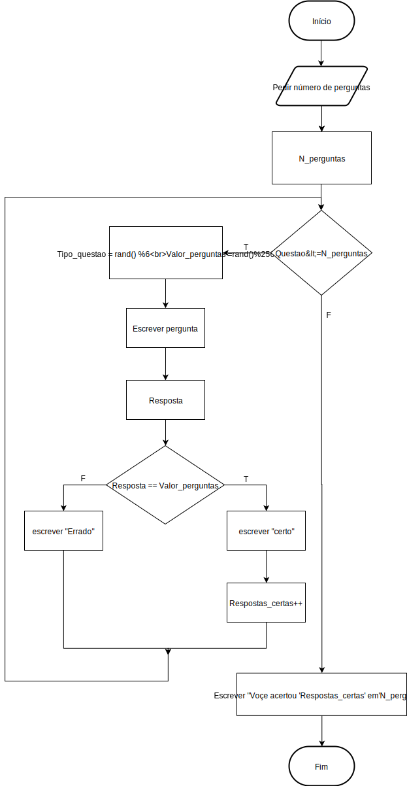

#1º Projeto de Introdução à Computação 2017/2018

####Rodrigo Garcia, a21704304
####Diana Nóia, a21703004

No âmbito deste projeto, foi-nos pedido que implementássemos um jogo para testar o nosso conhecimento de bases numéricas.
O jogo deve começar por pedir ao utilizador o número de questões que este quer responder, e cada uma deve pedir que converta um número numa base numérica para outra base diferente. Após a resposta, o jogo deve indicar se a resposta está certa ou errada e no final, indicar quantas respostas certas foram dadas.

O jogo pedido tinha os seguintes requisitos:

    "Os valores a converter devem ser aleatórios, positivos e limitados a 8 bits (unsigned char).
    As bases aceites para conversão devem ser octal, decimal e hexadecimal, ou seja, as questões podem solicitar aleatoriamente as seguintes conversões:"
        Octal => Decimal
        Octal => Hexadecimal
        Decimal => Octal
        Decimal => Hexadecimal
        Hexadecimal => Octal
        Hexadecimal => Decimal


Chegou-se à conclusão que teríamos de criar um gerador de números aleatórios, que escolhesse aleatoriamente um tipo de conversão das 6 pedidas para cada pergunta, e que gerasse também aleatoriamente um número para ser convertido em cada pergunta. Para isto utilizámos a biblioteca time.h, e a função srand((unsigned int) time(NULL)).
Depois para criar cada uma das 6 conversões pedidas utilizou-se a função scanf para a resposta, e if-else para vereficar se está certa ou errada,.

O programa que criámos tem o seguinte código C:
```c
#include <stdio.h>
#include <time.h>
#include <stdlib.h>

int main() {
srand((unsigned int) time(NULL));
unsigned int N_perguntas, Resposta, Respostas_certas = 0;

		
printf("Quantas perguntas queres responder?: ");
scanf("%u", &N_perguntas);
	
	for(unsigned int questoes = 1; questoes <= N_perguntas; questoes++) {
	unsigned int Tipo_questao= rand() % 6; //atribui numeros aleatorios de 0 a 5
	unsigned int Valor_perguntas=rand() % 256; //atribui numeros aleatorios de 0 a 255
		
		if(Tipo_questao == 0) {
		printf("Converte %d de base 10 para base 16: " , Valor_perguntas);
		scanf("%x",&Resposta);// recebe valor em hexadecimal
			if(Valor_perguntas == Resposta){
				Respostas_certas++;
				printf("Certo!\n");
			}else{
				printf("Errado!\n");
			}	
		} else if(Tipo_questao == 1){
		printf("Converte %d de base 10 para base 8: " , Valor_perguntas);
		scanf("%o", &Resposta);// recebe valor em octal
			if(Valor_perguntas == Resposta){
				Respostas_certas++;
				printf("Certo!\n");
			}else{
				printf("Errado!\n");
			}	
		}else if(Tipo_questao == 2){
		printf("Converte %x de base 16 para base 10: " , Valor_perguntas);
		scanf("%u", &Resposta);// recebe valor em decimal
			if(Valor_perguntas == Resposta){
				Respostas_certas++;
				printf("Certo!\n");
			}else{
				printf("Errado!\n");
			}	
		}else if(Tipo_questao == 3){
		printf("Converte %x de base 16 para base 8: " , Valor_perguntas);
		scanf("%o", &Resposta);// recebe valor em octal
			if(Valor_perguntas == Resposta){
				Respostas_certas++;
				printf("Certo!\n");
			}else{
				printf("Errado!\n");
			}	
		}else if(Tipo_questao == 4){
		printf("Converte %o de base 8 para base 16: " , Valor_perguntas);
		scanf("%x", &Resposta);// recebe valor em hexadecimal
			if(Valor_perguntas == Resposta){
				Respostas_certas++;
				printf("Certo!\n");
			}else{
				printf("Errado!\n");
			}	
		}else {
		printf("Converte %o de base 8 para base 10: " , Valor_perguntas);
		scanf("%u", &Resposta);// recebe valor em decimal
			if(Valor_perguntas == Resposta){
				Respostas_certas++;
				printf("Certo!\n");
			}else{
				printf("Errado!\n");
			}	
		}
	}
printf("Você acertou %d em %d\n",Respostas_certas,N_perguntas);	
return 0;
}
	
```

Depois criou-se o fluxograma:


Esta projeto ajudou a reforçar o nosso conhecimento sobre as bases numéricas, sobre os geradores de números aleatórios e as diferentes funções e expressões que já havíamos aprendido.


Referências:
>Utilizou-se a biblioteca [time.h](https://www.tutorialspoint.com/c_standard_library/time_h.htm)
>O gerador de números aleatórios foi retirado do [Stack Overflow](https://stackoverflow.com/questions/17846212/generate-a-random-number-between-1-and-10-in-c)
> Escrito com [StackEdit](https://stackedit.io/).
>Sugestões dos nossos colegas Rui Martins e Diogo Maia que sugeriram que programas usar para testar o nosso ficheiro markdown
>Sugestão do nosso colega Gabriel Nunes que sugeriu que usássemos um if else 
